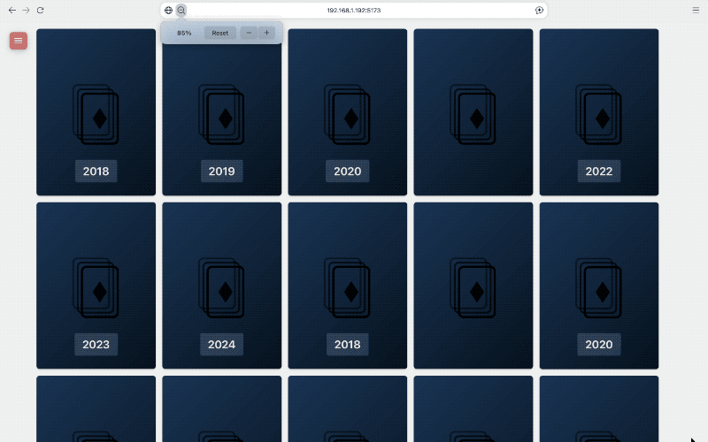

<p align="center">
  
</p>

<h1 align="center">Itemdeck</h1>

<p align="center">
  <strong>Adaptive Card Grid Application</strong><br>
  A browser-based card display system using a "Memory game" visual metaphor.
</p>

<p align="center">
  
  = 20.0.0">
  
  <br>
  <a href="https://claude.ai/claude-code"></a>
</p>

---

## Overview

Cards are arranged in a responsive grid with smooth repositioning animation. Each card maintains fixed dimensions and displays a card-back design with centred logo and optional year text. This is the foundation scaffold for a larger card-based application.

<p align="center">
  
</p>

## Prerequisites

- **Node.js** 20.0.0 or higher
- **npm** (included with Node.js)

## Getting Started

```bash
# Install dependencies
npm install

# Start development server
npm run dev

# Open http://localhost:5173 in your browser
```

## Available Scripts

| Command | Description |
|---------|-------------|
| `npm run dev` | Start development server with hot reload |
| `npm run build` | Build for production |
| `npm run preview` | Preview production build locally |
| `npm run typecheck` | Run TypeScript type checking |
| `npm run lint` | Run ESLint |
| `npm run lint:fix` | Run ESLint with auto-fix |
| `npm run format` | Format code with Prettier |
| `npm run format:check` | Check code formatting |

## Architecture

### Technology Stack

- **React 18** - UI framework with functional components and hooks
- **TypeScript** - Type-safe JavaScript with strict mode
- **Vite** - Fast build tool and dev server
- **CSS Modules** - Scoped component styling
- **Absolute Positioning** - JavaScript-calculated layout with CSS transitions

### Project Structure

```
src/
├── main.tsx                    # Application entry point
├── App.tsx                     # Root component
├── components/
│   ├── Card/                   # Individual card display
│   ├── CardGrid/               # Responsive grid layout
│   ├── MenuButton/             # Menu toggle button
│   └── Sidebar/                # Sliding sidebar panel
├── context/
│   └── SettingsContext.tsx     # Card settings provider
├── hooks/
│   ├── useCardData.ts          # Data fetching hook
│   └── useSettingsContext.ts   # Settings context hook
├── types/
│   ├── card.ts                 # Card data interface
│   └── settings.ts             # Settings interfaces
├── data/
│   └── cards.mock.ts           # Mock data for development
└── styles/
    └── global.css              # CSS reset and custom properties
```

### Key Features

- **Smooth Animation**: Cards animate to new positions when window is resized
- **Fixed Card Dimensions**: Cards maintain exact size (300×420px default)
- **Centred Grid**: Equal spacing on all sides
- **Animated Sidebar**: Grows from menu button to full-height panel
- **Type Safety**: Full TypeScript coverage with strict mode

## Documentation

- [Setup Prompt v1](./docs/prompts/setup/README.md) - Original AI setup specification
- [Setup Prompt v2](./docs/prompts/setup/v2.md) - Updated specification with design decisions
